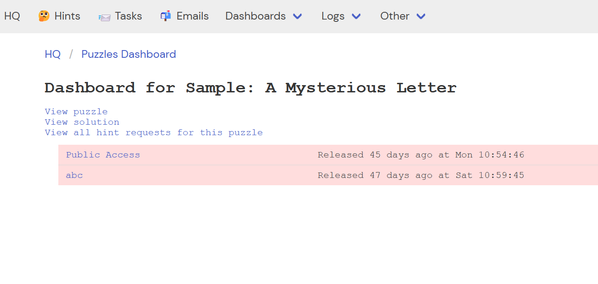
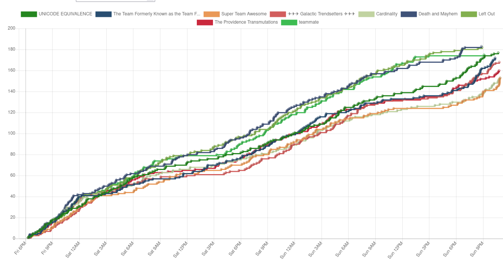

# Features
In 2022, we invested a lot of effort in expanding and improving upon earlier hunts. A lot of these features are non-obvious to solvers -- this page expands on some of the highlights.

This may be of interest to teams forking the repo or re-using some of the work we did. It also functions as a tour of the codebase, as features link to the relevant code section.

I highly recommend our [stats writeup](https://www.bookspace.world/stats/) for some details about the scale of the event.

> **Warning**: This page contains spoilers for 2022 puzzles.

## Copy to clipboard
We enhanced the [`copyjack` script](https://github.com/YewLabs/2021-hunt/blob/master/static/scripts/copyjack.js) from Galactic's 2021 Hunt. Our new version of [`copyjack`](/hunt/app/static/core/copyjack.js):

 - Supports copying images into Google Sheets. We reverse-engineered the internal API that Sheets uses to copy images in cells, and mimicked that when copying images. We also added a accessible fallback of using the alt text if for some reason, the image failed to copy. This drastically reduced a friction teams have in getting a puzzle ready for collaborative solving.
   - > :warning: **Update** Jan 18 2022.
     > Google Sheets changed the internal API for copying images, and so copy no longer works. Should be straightforward to fix though as they seem to base64 encode images instead.

 - Deeply integrates with our [standardised postproduction classes](postproduction.md) so that most puzzles just work. For example, copy to clipboard recognizes crossword grids, and pastes two copies so that solutions can be entered without clobbering clue numbers.

 - Handles barred crossword grids, and other grids with variable width borders. By default, those grids did not copy well, so `copyjack` rewrites them when copying to clipboard in a way that copies well, but doesn't break the puzzle.

 - Reliably handles default font families, font sizes, border sizes, flex containers, text alignment, and other styles, so that the Google Sheets output is natural.

 - Ensures the copied output is accessible where possible. We automatically include ordinals in lists, alt text instead of images, captions for tables, markdown-style emphasis where possible.

Many of the above features are optimized for copying to Google Sheets (as noted in [our FAQ](https://www.bookspace.world/faq/)), but also work well in other spreadsheets like Excel, and where possible, when pasting as plain text. For example, image copying falls back to showing alt text when pasting to places other than Google Sheets.

> **Note**: There are limitations. The biggest ones are that:
>  - Copying images to Google Sheets broke post-hunt as discussed above. The [`copyjack`](/hunt/app/static/core/copyjack.js) scripts contains my preliminary investigation into how to fix it.
>  - In a single cell, we can't mix multiple style types. We can't just italicize a few words in a cell -- either the whole cell is italics or none of it. This should be fixable by reverse-engineering the data structure that Google Sheets uses to handle this scenario. (It's a more complex data structure and I didn't want to change it close to hunt.)
>
> A PR to fix these issues will happily be accepted!

*Copying images*

*Copying tables*

*Copying complex grids*

## Focus on accessibility and responsive web design
A design goal was to make our puzzles accessible to as many people as possible. We worked closely with the MIT accessibility team, built our website and [notification systems](#notification-system) using best-practices for accessibility, and ensured our website and puzzles (where possible) worked well on as many devices and media as possible.

For example, our navigation system is one of the most fundamental parts of the website. We ensured it worked on all screen sizes, responded properly when puzzle content was wider than the screen, included all ARIA labels needed for screen readers, is appropriately hidden on print, and worked without Javascript.

A major challenge was our round maps. These were graphics-heavy, adapted based on the team progress, and we needed to keep accessible and responsive. We developed a ["sticker" system](#round-maps) to generate the right HTML based on the team's unlocked puzzles, and some sophisticated CSS to lay the map out and appear good on a range of devices.

Our small tech and accessibility team also provided tools and detailed guidance for puzzle postprodders on making sure puzzles were accessible. This included jumping in to specific puzzles when a tech or accessibility issue was raised.

*How we presented long descriptions of images when needed*

We also invested in making our website as efficient as possible so as to minimise puzzle loading time. This include efforts to [optimize caching](#caching) of puzzle pages, and [creating a build pipeline to deploy assets to a CDN](#assets-cdn).

## Caching
We designed caching of puzzle pages from the ground up to both improve the solver experience, and reduce our server costs. Caching puzzles is tricky as each solving team may have different access to puzzles, we never want to show a solver a stale version of a puzzle, and because of meta mechanics, often progress on another puzzle within a round can change the puzzle.

After a [careful analysis](/hunt/app/core/cache.py), we selected server-side caching of puzzle pages, and conditional HTTP responses to save on client round trips when the page hadn't changed. This reduced server costs and ensured we never served a stale page.

To implement this, we:
 - Implemented some [cache-busting logic](/hunt/app/core/callbacks.py) in response to certain events like solving a puzzle
 - Added special cases like inspecting for a CSRF cookie to detect if we're serving user-specific content that shouldn't be cached for the whole team
 - Identified puzzles with time-varying content (such as swag puzzles with a timer) to not cache them
 - Included cache resetting in our [CI/CD pipeline](#ci-cd-pipeline)
 - Wrote custom decorators to perform both the server-side caching and the conditional HTTP responses for developer ergonomics, handling the special cases above, and efficiency by not re-computing cache keys.
 - Added bespoke caching for hot paths such as loading teams and hunt settings, or slow actions like reading puzzle content from the filesystem.
 - Made caching configurable, so that we could disable it in dev environments.

The cache hit rates were over 90% during the hunt, so this reflected a major reduction in both server costs, and improving the solver experience.

## Improved user system
Many recent hunts have used a simple system for team logins that includes using plaintext passwords. We switched to using Django to manage users instead, which unlocks more powerful features such as authentication backends and password reset flows, as well as being much more secure.

As part of this, we separated teams from users as two separate concepts. This paves the way to allowing each user within a team to have their own user account, which removes the need for password sharing and improves scrum puzzles.

This let us collect more team information than usual, such as the solver breakdown and the team history, and this information was invaluable for Puzzle Club.

> **Future work**: Because of time limitations, we didn't get a chance to build a team registration dashboard. Future teams should definitely build a dashboard showing teams and their registration info, along with some free-text or structured notes columns. This would have been very useful for swag, team matching, and verifying registration forms.

> **Future work**: Consider allowing each user within a team to have their own user account, and enabling a password reset flow.

## Authentication
Our 2022 hunt was split across three domains -- the registration site <https://www.mitmh2022.com>, and the two hunt websites that were separate for story reasons <https://www.starrats.org> and <https://www.bookspace.world>. This made authentication a challenge as cookies/sessions from one of the domains could not be accessed from the other domains.

We built an SSO system so that authenticating on the registration website gave access to the hunt websites. This was made simpler because all three websites had access to the same database so they could use that to communicate, and so there was no need to reach for a third-party SSO solution.

The SSO system includes:
 - [Log in support](/hunt/registration/views/auth_views.py) on the registration website.
 - Multiple log in modes including an ordinary log in, an SSO log in that should redirect to a target website with a credential, and an "escalate" log in where the current credentials are insufficient (e.g. if you're trying to access [HQ](#hq) without an admin account).
 - Securely [using SSO tokens to log in](/hunt/app/views/auth_views.py) on the hunt websites.
 - Correctly redirecting to the correct original URL across multiple domains.
 - [Synchronising the current team](/hunt/app/core/hosts.py) across domains when [linking between them](#multiple-domains).

> **Future work**: A nice-to-have would be that if you log out on one domain, it should log you out across all three. This might work by linking user sessions on star rats and bookspace to the original session in the registration site. When the registration site session is logged out, then it can expire all child sessions on star rats and bookspace. (This is mostly a problem for the tech team as they try out multiple teams.) If done correctly, the complex team syncing code would probably no longer be needed.

## Multiple domains
For story reasons, our puzzles were split across multiple domains. Some pages also dynamically changed the domain they should appear on based on the team's progress through the hunt.

We implemented a [declarative way](/hunt/deploy/hosts) to configure the multiple domains, leveraged [`django-hosts`](https://django-hosts.readthedocs.io/en/latest/) to react to the current domain, and wrote decorators to [redirect between domains](/hunt/app/core/hosts.py) based on the team's progress. This also introduced extra challenges in the [SSO authentication system](#authentication).

If you're [deploying the hunt yourself](deploy.md), you'll need to make some config updates to reflect the domain(s) you're using.

## Notification system
The notification pattern let team members know when there is a HQ update, or progress was made on a puzzle by any team member, with optional sound jingles for solves. We enhanced [the notification system](/hunt/app/static/core/site.js) inherited from Galactic's 2021 Hunt to:
 - Improve accessibility by using the appropriate ARIA roles.
 - Add [theming and solve sounds](/hunt/app/core/callbacks.py) associated with each notification.
 - Also support post-solve bonus content (like the challenges in New You City) and [rewards](/hunt/app/core/rewards.py) (like the profile pictures after completing Star Rats). This let us inject page content to a server-rendered page, without reloading and breaking solve sounds, and so was a major usability improvement.
 - Synchronise the puzzle state, by refreshing the answers iframe when the puzzle was solved. This means if one team member solves the puzzle, everyone will see that it has been solved.
 - Leveraged the notification system to share story beats as teams progress through the hunt.
 - Added mobile support for the notifications system.
    > **Future work**: The re-theming slightly broke the mobile notifications system, and so the CSS needs some tweaking.

*Our refreshed notification system*

*Mobile support for the notification system*

## Assets CDN
We stored assets for the hunt, such as round and puzzle graphics, on Google Cloud Storage as a CDN. This is much cheaper than serving the assets from the webserver directly (using something like [whitenoise](http://whitenoise.evans.io/en/stable/) or [App Engine](https://cloud.google.com/appengine/docs/standard/python3/serving-static-files#serving_from_your_application)) and was especially important this year with our graphics-heavy hunt. In total, we served 1.2 TB of static assets in the month around hunt.

*Graph showing bandwidth usage during hunt for our Google Cloud Storage buckets*

We rewrote [the script from Galactic's hunt](https://github.com/YewLabs/2021-hunt/blob/master/deploy_static.py) to:
 - Integrate it with [Django's command system](/hunt/deploy/management/commands/collectpuzzlefiles.py), so we could use features like Django's settings.
 - Store all static files for cheaper hosting and a better solver experience.
 - Included deploying assets as part of our [CI/CD infrastructure](#deploy.md), so that any member of the tech team could easily update them.
 - Included an asset rewriting stage to support our [puzzle build process](#puzzle-build-process).

## Rewriting assets
The [CDN](#assets-cdn) means assets are conditionally served from the local server (dev environments), or from either our staging or prod CDN. We wrote an [asset rewriter](/hunt/app/core/assets/) that automatically rewrote postprodded puzzle assets at serve time. This meant our postprodding team could develop and test the puzzles naturally using relative paths, and the server took care of everything automatically. This quashed classes of bugs where puzzles would work locally but not on the server, and made the postproduction process much more accessible so more of our team could take on postproduction.

The CDN included unpredictable hashes of puzzle details in the path, so that solvers could not access puzzle assets until they had access to the puzzle. For security, we needed separate hashes for solutions and posthunt versions of the puzzle, and the asset rewriting transparently took care of this.

## Puzzle build process
As we postprodded puzzles, it became clear that some of them would benefit from more modern web tooling (i.e. [Gears and Arrows](https://www.bookspace.world/puzzle/how-to-spell-with-gears-and-arrows/) - [source](/hunt/data/puzzle/how-to-spell-with-gears-and-arrows/)).

We introduced a [build process](/bin/build-assets.ts) and some conventions such as naming files `index.template.html`, `main.ts`, and `style.scss` in a postproduction bundle, so that we could selectively compile certain puzzles. This let us incorporate Typescript and SASS to certain puzzles, and made post production and maintenance much easier. Being selective means only some of our postproduction team needed to worry about the extra steps in build complexity.

We also allowed generating the HTML content of puzzles. This is valuable because some puzzles are repetitive and could be more easily generated (i.e. a mostly empty crossword grid, or the maths-heavy gears and arrows puzzle linked above). However, the source code for generation could be spoilery (such as in [The Messy Room](/hunt/data/puzzle/the-messy-room/)), or it would slow down puzzle rendering if it synchronously depended on Javascript execution. Instead, we allowed injecting tags such as `{{gen:gen-puzzle}}` that automatically included `stdout` from running the [referenced script](/hunt/data/puzzle/the-messy-room/__build/gen-puzzle.ts).

The build scripts uses [`esbuild`](https://github.com/evanw/esbuild) as the bundler for speed, performs Typescript type-checking in parallel so as to not block the build, and is incorporated into our [CI/CD pipeline](#ci-cd-pipeline). This makes it quite fast, although in the future, it could benefit from being made more incremental.

The build script also performs bundle splitting to reduce duplication between the Javascript bundles of similar puzzles. This integrates with the [asset rewriter](#asset-rewriting) so that Javascript chunks are referred to correctly across [environments](deploy.md), and let us invest into [a common framework that made writing interactive puzzles easier](#framework-for-writing-interactive-puzzles).

> **Note**: See [instructions on building the puzzles](../#building-puzzles).

> **Future work**: It would be useful to also have a similar build process available for [common stylesheets](/hunt/app/static/stylesheets/site.css) and [scripts](/hunt/app/static/core/site.js).

## Framework for writing interactive puzzles
We identified a few different categories of interactive puzzles, and wrote common front- and back-end frameworks to implement them. This made implementation simpler, allowed features and bugfixes to improve all affected puzzles, and allowed frontend code reuse using [bundle splitting](#puzzle-build-process) for a better solver experience.

Types of puzzles:
 - [Minipuzzles](#minipuzzles) within a larger puzzle. We wrote some dedicated components and backend helpers to make these as easy and full-featured as possible. These were used in many puzzles such as [The Tollbooth endgame puzzle](https://www.bookspace.world/tollbooth/) and [Strange Garnets](https://www.bookspace.world/puzzle/strange-garnets/).

 - Puzzles with an oracle to check if an answer is correct. These required a very simple backend, and we wrote some helpers like [`fetchJson`](/hunt/app/scripts/helpers.ts) to consolidate authentication and CSRF. An example is [Word Search of Babel](https://www.bookspace.world/puzzle/word-search-of-babel/).

 - Puzzles where there is state, but the client shouldn't be able to "cheat" by changing the state. For these, we used the session puzzle ([frontend](/hunt/app/scripts/retriable-session-puzzle.ts) and [backend](/hunt/app/special_puzzles/session_puzzle.py)) framework to handle features like restarting, retrying upon disconnection, out-of-order messages, and invariant checking. An example is Match 6 in [Strange Garnets](https://www.bookspace.world/puzzle/strange-garnets/).

 - Puzzles where there is shared state amongst the team. The state could be "progress" flags such as whether they've won a level, or a common workspace such as the collaboratively filled dropquote grids in [The Messy Room](https://www.starrats.org/puzzle/the-messy-room/). For a good solver experience, this state should be synced across all team members and immediately reflected in the UI.

For syncing state, we recognised that different puzzles has overlapping but distinct requirements. For code reuse, we built a modular plugin system that used a single WebSocket connection and let the puzzle's backend pick and choose what behaviours were desired.

This framework approach allowed us to reuse complex features like the list of shared states in [The Messy Room](https://www.starrats.org/puzzle/the-messy-room/) and [Gears and Arrows](https://www.bookspace.world/puzzle/how-to-spell-with-gears-and-arrows/).

*The common states list enabled by using a standardised framework*

For details about the framework, please read the [special puzzles documentation](/hunt/app/special_puzzles/).

## Minipuzzles
Many mystery hunts contain minipuzzles because either writing 200 puzzles isn't hard enough, or because it's useful to provide checks along the solving path. Our hunt made heavy use of minipuzzles.

We built a standardised framework for minipuzzles with features such as a guess log, a cohesive visual style, and optionally, synchronising guesses and "whether it is solved" across all team members viewing the minipuzzle. The [backend](/hunt/app/special_puzzles/team_minipuzzle_plugin.py) uses the [modular plugin system](#framework-for-writing-interactive-puzzles) to multiplex minipuzzle solve status across a single WebSocket connection. The frontend can then embed a [predictable iframe URL](/hunt/app/views/puzzle_submit_views.py), and listen to the socket to keep the minipuzzle iframe up-to-date.

A good example implementation is Strange Garnets: the [backend](/hunt/data/special_puzzles/puzzle246_strange_garnets/consumer.py) installs `TeamMinipuzzlePlugin` to register the backend, and in the frontend, the [HTML file](/hunt/data/puzzle/strange-garnets/index.template.html) embeds iframes for each minipuzzle, and the [Typescript file](/hunt/data/puzzle/strange-garnets/main.ts) sets up a WebSocket listener to synchronise the iframe across members of the team.

*A minipuzzle iframe with some incorrect guesses*

*A successfully solved minipuzzle*

There were also hooks for customizing the look-and-feel as used by [Once Upon a Time in the Quest](https://www.bookspace.world/puzzle/once-upon-a-time-in-the-quest/).

*Customizing the look and feel of the minipuzzle iframes*

## CI/CD pipeline
Our tech team was pretty small, and had a limited budget. As a result, we needed to make builds and deployment as simple as possible so more of Palindrome could contribute to postproduction, and needed to explore free and low-budget environments to keep costs down for our internal testing. As a result, our codebase is designed to run across multiple environments based on some declarative configuration, and deployments were automated through Github Actions.

The deployment includes [busting the cache](#caching) for our Google App Engine environments. This is needed because we ran a separate caching server (Redis) that kept its state during releases, but accessing it is non-trivial because the caching server could only be accessed from the same Google network. We wrote a simple Google Cloud Function to [nuke the cache when needed](/cloud_functions/nuke_cache/).

To find out more, please read:
 - The [documentation on our Github Actions](/.github/workflows)
 - The [deployment configuration docs](/hunt/deploy/)
 - Our [guide to deploying on your own environment](deploy.md)

## Round maps
Our round maps this year were graphics-heavy, with wordmarks for each round, detailed backgrounds, tiled background textures, and icons for each puzzle. We needed the maps:
 - To be responsive so that it looked good on all screen sizes.
 - To reflect team progress so that only available puzzles are shown.
 - To have different behaviour across rounds. Some were "pushdown" maps that expanded the icon area as more icons appeared, whereas some were "fixed" maps that always took the same space. For [The Ministry](https://www.bookspace.world/round/the-ministry/), we also had a pannable map.
 - Some used fallback images when a puzzle was locked, like [Whoston](https://www.bookspace.world/round/whoston/).

*The Ministry map was draggable*

*Whoston's map featured fallback images when a puzzle was locked*

To make this maintainable, we introduced the concept of "stickers" for a map. This was a way to declaratively indicate how icons for a round map should be positioned and when they should be shown in a ["manifest"](/hunt/data/round/whoston/manifest.py),then [collating that manifest](/hunt/app/views/round_views.py) with the team's current progress, and then [rendering it as part of the round's template](/hunt/data/round/generic_map.tmpl). Some rounds also used custom sticker rendering such as the [Plot Device](/hunt/data/round/plot-device/round.tmpl), which reused stickers for the "pages" containing the wordmark for each solved Act 3 round.

We set up some [common styles for the different types of maps](/hunt/app/static/stylesheets/map.css), and then the manifest encapsulated specific positioning and tweaks for each puzzle's icon. This made it easier to maintain, and for members of the team to pick up "stickering" over 200 puzzle icons into the appropriate place.

> **Future work**: Each sticker icon had a predictable filename (`1.png`, ...) so teams were able to see the icon for other puzzles in the round, or determine the total number of puzzles within a round. This was mostly innocuous, but the icons were slightly spoilery.
>
> We should rename each icon referred to in `manifest.py` as we [deploy them to the CDN](#assets-cdn) to include a deterministic hash. Then the [sticker collation process](/hunt/app/views/round_views.py) can inject that hash so the frontend is still able to load accessible icons.

> **Note**: There are some undocumented URL parameters that you can find in [`round_views.py`](/hunt/app/views/round_views.py) such as `puzzle_count=4` to control stickering in internal testing.

## Enabling a streamlined puzzle postproduction process
Our tech team was very small, and only began work on the hunt website in earnest four months before the hunt. In that time, we had to stand up the hunt website we inherited from the 2021 hunt, make desired changes, postproduce all the puzzles and rounds, make all the interactive puzzles, and more.

As a strategic decision, we optimised the postproduction process to be as easy as possible, so that a larger swath of Palindrome could participate. Even without our time crunch, the investment in streamlining postproduction was helpful as it meant we could churn out higher quality puzzles, and I **highly recommend** it for future hunt teams.

Some concrete steps we made:
 - We provided [detailed documentation](postproduction.md) on the post production process and our accessibility expectations. This broke down decisions in a step-by-step way, provided a simplified "easy" way to begin postproddding, and shared code samples and screenshots of our common postprod styles and recipes. This document received rave reviews from members of Palindrome, and made postprodding much more approachable.

 - We prioritized producing a set of [common composable styles and classes](/hunt/app/static/stylesheets/site.css) for standard postprodding recipes. These were modular, reliable, and had built-in support for responsiveness and print support when possible, so puzzles got this behavior for free. This had flow-on benefits like a cohesive visual style, and making hooks available for more complex [copy to clipboard](#copy-to-clipboard) behavior.

 - We had a (Discord) channel for questions about postprodding, and the tech team treated questions as a high-priority. This kept postprodders from getting stuck, and puzzles getting abandoned. It also made answers highly visible to all postprodders and so became a useful place to share knowledge.

 - We invested in getting [Puzzleviewer](#puzzleviewer) operational on our staging site ASAP, so that puzzle postproduction could begin, independent of progress on the main hunt website.

*A graph showing how puzzles moved through the development process. Notice the spike in postprod rate starting mid-October*

## Improved answer checker
We identified and improved on some issues with automated answer checking such as:
 - Not penalizing repeated guesses.
 - Being resilient to diacritics and foreign languages.
 - Supporting "partial answers" for a puzzle (such as clue phrases extracted from the puzzle), and showing a confirmation or hint phrase.
 - Synchronising the guess log across team members, so that guesses by another team member viewing the same puzzle show up immediately without a refresh.
 - Showing the above information in a useful guess log for the puzzle, so that large teams can see the full history of their puzzle attempts.

## Puzzleviewer
In Galactic's 2021 hunt codebase, they had [a small Django app called Puzzleviewer](https://github.com/YewLabs/silenda/tree/master/puzzleviewer) for viewing postprodded puzzles independent of the main website. This has two main benefits:
 - Puzzles can be viewed and tested before the main hunt website was ready.
 - Puzzles can be viewed independent of whether they are "unlocked" for the logged in team.

We [revamped Puzzleviewer](/hunt/puzzleviewer/) and made it more similar to our real puzzle rendering flow, including features like [asset rewriting](#rewriting-assets). We also hashed the answer in source code, so as to not accidentally spoil the puzzle during testsolve sessions.

## Registration site
We released a registration site in advance of the hunt to collect team signups. This is mostly a standard Django website and form. Notable features or fun tweaks include:
 - Using the registration site as a hub for our [SSO authentication](#authentication).
 - Continuing the tradition of collecting team emojis, and trying to work out how to [validate emojis](/hunt/registration/models.py) the day before the site launched.
 - [Building a scroller](/hunt/registration/templates/registration/index.tmpl) that behaved across browsers, was responsive, and wrapped nicely (based on a design by [Jacob Ford](https://jacobford.com/)). It even became the basis of a puzzle. In the end, we had to compromise on the responsiveness because SVG animation is not quite there yet across browsers.
 - Building on the cult of Zappy by [adding them to the registration site](/hunt/registration/templates/registration/index.tmpl) when round 0 launched

*An animated SVG scroller that became part of a puzzle*

*Zappy taking over the hunt registration page when round 0 launched*

## Refreshing the codebase
This codebase is built upon many hunt iterations including the [2021](https://github.com/YewLabs/2021-hunt) [Galactic hunt](https://github.com/YewLabs/silenda), and going all the way back to [at least 2014](https://github.com/mysteryhunt/spoilr). It had some issues such as stale or confusing codepaths, as well as not being explicitly licensed.

This codebase is an almost complete rewrite and restructuring of our inherited code. It adds the new features discussed here, rewrote the [HQ interface](#hq) (and gave it a facelift), and rethought modelling. In particular, it focuses on splitting code in a modular way, so that pieces can be lifted without using the whole codebase, or a team [forking this codebase](fork.md) can replace just the bits they care about.

It is also explicitly licensed, and has documentation about [deploying](deploy.md) and [managing](#manage.md) the hunt, so future teams can begin work without repeating a lot of the work earlier teams have done.

As a statistic, the internal version of this codebase had over 6000 commits during the 4 months of high activity leading up to hunt, and about half of those were on website core code (i.e. code unrelated to postprodding puzzles).

> **Future work**: This process is necessarily incomplete, and a bunch of incomplete TODOs are [documented here](future.md). Some are [highlighted below](#future-work)

## HQ
There's a lot of work behind-the-scenes to run the hunt. This includes:
 - Responding to emails, hints, contact requests.
 - Live interactions and check-ins with teams.
 - Grading submissions from teams for the self-help round and the scavenger hunt.
 - Running events.

The credits at <https://www.bookspace.world/credits/> give some idea of the number of people involved, and <https://www.bookspace.world/stats/> shows the scale of hints/emails/interactions handled. HQ provides tools to manage this flood of information, as well as keeping tabs on the progress of the hunt.

HQ is based on an inherited project called [spoilr](https://github.com/YewLabs/silenda/tree/master/spoilr), but we refreshed both the internals and look-and-feel of spoilr as part of the 2022 hunt.

*Overview dashboard for HQ*

### Progress
We built or refreshed some dashboards for team and puzzle progress. Here are some screenshots. [(code)](/spoilr/progress)

*Teams dashboard summarizing puzzles solved by each team*

*Detailed dashboard for a specific team*

*Puzzles dashboard summarizing how many teams have solved each puzzle*

*Detailed dashboard for a specific puzzle*

*Solves over time for the top teams in the 2022 Hunt*

*Log of all activity for the hunt*

*Viewing summary of all interactions*

The dashboards also expose hooks to impersonate teams if needed. **Note**: This can break due to [multiple domains](#multiple-domains) as documented in [hosts.py](/hunt/app/core/hosts.py).

*Impersonating a team to see their progress or debug issues*

### Hints
We built a flow to see hint requests, claim and reply to them, and view canned hints we'd pre-written before the hunt.

*Viewing hint requests ([code](/spoilr/hints/))*

*Viewing all past hint requests ([code](/spoilr/hq/log.py))*

> **Future work**: Refresh the hint log view.

### Interactions
Interactions are a general (confusingly-named) concept for "HQ needs to take some action". This could be because we need to arrange a meeting before they get credit for a scavenger hunt item, it could be because we need to grade a submission, we need to have a story interaction before unlocking the next puzzle, because we approve a free answer request, or anything really.

Interactions are [automatically created](/hunt/app/core/interactions.py) in response to solving certain puzzles, receiving emails with a certain subject, or other triggers (i.e. time passing). HQ provides a dashboard for handling them, including hooks to plugin special UI for different types of actions. ([code](/spoilr/interaction/))

*Viewing all pending interactions*

*Viewing details for a specific interaction*

> **Future work**: The interaction UI is still confusing, and uses UI elements and colours erratically. It probably needs some cleaning up to be more user friendly.

> **Note**: The interaction UI exposes some magic URL parameters such as `danger=1` to enable extra UI actions. These are not documented deliberately, but dig around the code if you want to see what they do.

### Emails and contact requests
During the hunt, we received thousands of emails over the course of the weekend. We needed a scalable way to split the load of this, without risking getting locked out of a shared email account.

We also needed to programatically handle certain emails. For example, if we received an email to `submissions@`, then we should automatically open the appropriate interaction for the team.

We addressed this by building an email management tool to send, receive, sort and categorise emails. Most of the code lives in [spoilr/email/](/spoilr/email/) including parsing incoming email. The [hunt-specific logic](/hunt/app/core/interactions.py) manages whether to treat the email as an interaction submission, whether to put it into our unread email queue (during hunt weekend only), or to ignore it.

The system was based on sending all emails to SendGrid to parse them with a webhook. As this was newly built and so inherently risky, we also relayed all emails to a gmail address shared with select team members. This relaying introduced new challenges and failure modes, such as hitting mailgun API limits, not being able to relay emails from some domains due to DMARC verification, or having unexpected incoming email formats. See the [tech stack docs](tech-stack.md) for details on the tradeoffs of our approach.

*Some of our email management dashboard*

*Some of our contact request dashboard*

> **Future work**: Our dashboard doesn't yet support attachments, which we dealt with by discouraging email attachments. We have a proof-of-concept PR to upload attachments to Google Cloud Storage and include a link to the attachment in our dashboard, but we didn't merge this due to a lack of testing time. If reusing this dashboard, reach out and we can share the prototype code.

## Future work
There are several pain points in spoilr still to highlight. If forking this codebase, I recommend investing time to address these.
 - Handling HQ updates and/or errata - the flow is pretty manual right now (use the Django admin panel to make an update model, go back to spoilr and mark it as published). This sends a bulk email synchronously which is untenable and lead to many dropped emails. This definitely needs some ergonomic improvements, and a task queue for actually sending emails.
 - We have some helper URLs `/hq/manage/nuke-cache` and `/hq/manage/unlock-puzzles` to trigger certain flows and address issues. It would be better to expose these within spoilr itself.
 - Likewise, we have a `/hq/tick` URL to advance time-dependent hunt state (such as unsnoozing interactions). This is probably better as a cron job (although would need to set up some kind of authentication token).
 - We should have had better dashboards for the events team (who has registered) and our registration dashboard, but ran out of time.
 - The hunt has a [lifecycle](manage.md) that is currently managed using commands. It would be nice to expose these in spoilr too.
