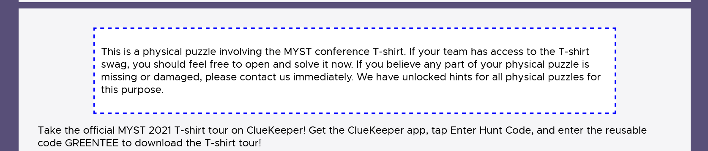

<!-- Converted using the excellent `Docs to Markdown` addon. -->

# Post Production Tips

This is a guide for how to create, test, and publish postprod versions of a puzzle. It demonstrates some  common styles and recipes.

The target audience is the _postprod team_ - anyone who will convert a testsolved puzzle into HTML/CSS/Javascript to be used directly in our hunt.


## The process {#the-process}

For a puzzle to be part of our hunt, the following happens:


1. The _puzzle author_ develops a puzzle idea.
2. The author adds the puzzle to [PuzzUp](https://lol.puzzup.lol) and testsolves/refines the puzzle.
3. The author marks their puzzle as `Needs Postprod`.
4. A _postprodder_ from the _postprod team_ picks up the puzzle and adds themself as a postprodder in PuzzUp.
    * Some puzzles are _special_ and require a custom backend (i.e. scrum puzzles). The author should file a tech request in PuzzUp, so that it can be picked up by a postprodder with an appropriate skillset.
5. If the postprodder needs more information (the solution, original images, alt text, etc), they mark the puzzle as `Postprod Blocked`.
6. The postprodder converts the puzzle to a HTML/CSS/Javascript _bundle_.
7. The postprodder adds the bundle to the hunt repository.
8. The postprodder and author test the puzzle using [PuzzleViewer](https://palindrome-hunt-staging.herokuapp.com/puzzlelzzup/), refine the puzzle, and repeat until the puzzle is satisfactory.
9. The postprodder marks the puzzle as `Awaiting Postprod Approval`.

At a later stage, the _hunt website team_ will add the puzzle to a round, set up unlock criteria, import it to the database, etc. It will then be available properly from the hunt website.

Steps 3 through 9 are shown in the figure below.


## Staging environment {#staging-environment}

You can see our website and puzzles in our staging environment. It’s safe to make changes here, and for some of them, code is automatically pushed so it can be used to test postprodding changes.


1. Go to [https://palindrome-hunt-staging.herokuapp.com/WEBSITE_ACCESS_TOKEN](https://palindrome-hunt-staging.herokuapp.com/WEBSITE_ACCESS_TOKEN)
    * This proves you're part of Palindrome so we're not accidentally spoiling the hunt to people who discover our URL.
    * If you ever see "Not found", you need to do this again.
2. Go to [https://palindrome-hunt-staging.herokuapp.com/](https://palindrome-hunt-staging.herokuapp.com/) and login using one of the following teams:
    * `admin / PASSWORD  (if admin doesn't work use admin__shared)`
    * `internal / PASSWORD`
3. Access puzzles at [https://palindrome-hunt-staging.herokuapp.com/](https://palindrome-hunt-staging.herokuapp.com/) or Puzzleviewer at [https://palindrome-hunt-staging.herokuapp.com/puzzlelzzup/](https://palindrome-hunt-staging.herokuapp.com/puzzlelzzup/)

We also (sometimes) have a Google App Engine (GAE) environment. The instructions for that are:


1. Go to [https://staging.mitmh2022.com/WEBSITE_ACCESS_TOKEN](https://staging.mitmh2022.com/WEBSITE_ACCESS_TOKEN) and [https://staging.starrats.org/WEBSITE_ACCESS_TOKEN](https://staging.starrats.org/WEBSITE_ACCESS_TOKEN) to prove you’re part of Palindrome.

2. (Sometimes needed) Go to [https://staging.starrats.org/login](https://staging.starrats.org/login) to get logged in properly

3. Access puzzles at [https://staging.starrats.org](https://staging.starrats.org) and [https://staging.starrats.org/puzzlelzzup/](https://staging.starrats.org/puzzlelzzup/)

(The GAE environment is the tech team’s playground, and lets us test things like scheduling the hunt and access before launching. I may also take it down because it’s relatively expensive.)


## Picking a puzzle {#picking-a-puzzle}

Visit the [PuzzUp Postprodding Dashboard](https://lol.puzzup.lol/postprod) to see:


* All puzzles that need postprodding and have not been claimed by a postprodder yet.
* The list of puzzles you are currently postprodding.


To start postprodding:


1. Pick any puzzle from that list.
    * **Tip**: look for puzzles that you’re spoiled on. It’ll be easier to postprod as you know the puzzle, and it keeps you available for future testsolves.

2. Check the puzzle is within your skillset.
    * Read the spoiler-free summary to get an idea of what the puzzle needs.
    * Spoil yourself if necessary, and then read the description and puzzle content.

    * Check if there are any tech support requests for the puzzle. If so, make sure you’re comfortable taking them on.


3. Add yourself as a postprodder using the one-click add/remove actions.

 and then


4. Check if the puzzle and solution are ready to be postprodded.
    * Verify
        * The puzzle content and solution are provided and complete.
        * Any images, audio files, videos, YouTube links, etc are available. (If the author hasn’t indicated where files are, they may be in the [Google Drive Puzzles folder](https://drive.google.com/drive/folders/1QSFSMetBJnwPWynX7SgzxLl_a4sTEX4v)).
        * Images, audio files, and videos all have a reasonable filesize and quality.
        * Images all have alt text provided, or the author indicates that alt text should be omitted to avoid spoilers.
    * If the above are not met, let the puzzle author know.
        * Either join the discord channel (if needed) and send a message, or add a comment at the bottom of the puzzle.
            * **Tip**: To join the discord channel, there’s a button on the puzzle page in the “Discord Channel” section.
            * **Tip**: If you choose Discord, then you can get notified when the puzzle is ready to be postprodded again.
        * Mark the puzzle as requiring revisions. Click “Show next steps” and then “Request revisions to puzzle/solution”.


5. Move to the step labeled “Postprodding has started”. This will change the status to **Actively Postprodding**.


Now you’re ready to postprod the puzzle. Try to only be postprodding at most a few puzzles at a time.


## How to postprod {#how-to-postprod}

Postprodding takes the puzzle concept and converts it into an HTML/CSS/Javascript _bundle_ that is as accessible as possible, and can be served from the hunt website.

Some puzzles are _special_ and require custom backend support. They still require a _bundle_ as described below. Recipes for implementing the custom backend are discussed in a later section.


### Choose how to deploy postprodded bundle {#choose-how-to-deploy-postprodded-bundle}

There are two options for deploying and testing your postprodded puzzle.

I’d recommend using Option 1 only if all of the following are true:


* You’re the only postprodder working on the puzzle.
* The puzzle and solution are straightforward to code, and unlikely to require much refinement.
* The puzzle hasn’t been marked as “finished” or “ready for approval”. Otherwise, others may have made changes through Git.

If you’re comfortable with Git and the command line, prefer Option 2.


#### Option 1: Deploy through PuzzUp {#option-1-deploy-through-puzzup}

You can create the puzzle bundle as local files on your computer, zip them up, and upload them to PuzzUp.

Advantages:


* No need to learn Git, use the command line, or install anything.

Disadvantages:


* When testing locally, the puzzle will be missing common styles such as `.flavor` or automatic centering of tables.
* When testing on staging, it takes up to 5 minutes for your changes to arrive.
* It’s easy to accidentally clobber someone else’s changes to the postprodded puzzle.

Steps:


1. Download and unzip the latest zip file from the puzzle page (if any).

   * **Warning**: If someone has made changes to the postprodded puzzle through Git, their changes won’t be shown in PuzzUp. This can lead to overwriting the changes in Git, which is just generally bad.

2. Create or edit your puzzle bundle as [described in the next section](#create-the-puzzle-bundle).

3. Test the puzzle by opening `index.html` and `solution/index.html` in any browser.
    * **Note**: the hunt website applies certain common styles like italicizing `.flavor` and centering tables. Your version will be missing these styles.

4. Zip your puzzle bundle so that your files are directly zipped <span style="text-decoration:underline;">with no containing folders</span>. (The zip file can have any name.)

<table>
  <tr>
   <td>
<strong>Good</strong>
   </td>
   <td><strong>Bad</strong>
   </td>
  </tr>
  <tr>
   <td>


   </td>
   <td>


   </td>
  </tr>
</table>


5. Upload your puzzle bundle through PuzzUp.

and then

    * The “slug” is the URL at which the puzzle is available. You probably don’t want to change this. Any unicode including emojis is allowed.
    * Avoid asterisks and dots though, as they can break the development environment for others.

6. Check the puzzle is correct on our staging environment.
    * Wait a few minutes and then open it in Puzzleviewer. There will be a link on the puzzle page in PuzzUp.

    * If there are issues, edit your bundle and repeat the above steps.
    * If it doesn’t load in Puzzleviewer, check that you zipped the files correctly in Step 4. Then reach out to `#tech-team` on Discord for help.


#### Option 2: Use Git (and optionally a local server) {#option-2-use-git-and-optionally-a-local-server}

You can use Git to create and edit the puzzle bundle. Optionally, you can also run a local server so that you can test the puzzle as it would appear in the hunt website.

Advantages:


* It’s safer when multiple people may be making changes.
* With a local server, can test locally as it would appear on the hunt website.

Disadvantages:


* Need to be familiar with Git.
* (Optional) The local server takes a little bit of setup.

When making or editing puzzles:


1. (First-time only) Request access to the repository, either in **#tech-team** or **#general**
2. (First-time only) Clone the repository for the hunt website server.

```
git clone https://github.com/Palindrome-Puzzles/2022-hunt.git
cd 2022-hunt
```


3. (First-time only) Enable Git Large File Storage (LFS) support.

```
git lfs install
```


4. Pull changes if needed.

```
git pull
```

5. Get the puzzle metadata and “slug”.
    1. From the puzzle page, begin uploading a postprodded version. <span style="text-decoration:underline;">(Click “upload one now”)</span>

    1. Then download `metadata.json` from the link on that page.

    1. And take a note of the puzzle slug lower on the page.

    1. Close the postprod page as it is no longer needed.

6. Create a folder named the same as “slug” in `hunt/data/puzzle`. Add the downloaded `metadata.json` file inside the folder.
    1. Example: for the above screenshot, the metadata would be at `hunt/data/puzzle/three-blind-mice/metadata.json`.

7. Create or edit your puzzle bundle within this created folder as [described in the next section](#create-the-puzzle-bundle).

8. Test the puzzle by either:
    1. Opening `index.html` and `solution/index.html` in any browser.
        1. **Note**: the hunt website applies certain common styles like italicizing `.flavor` and centering tables. Your version will be missing these styles.
    1. [Run the local server](#bookmark=kix.tu77fal4nsox) and view the puzzle using Puzzleviewer at [http://localhost:8000/puzzlelzzup/three-blind-mice/](http://localhost:8000/puzzlelzzup/three-blind-mice) (or whatever your slug is).

9. Commit and push the changes.

```
git add -A
git commit -am 'Add postprodded bundle for three blind mice'
git push
```


10. Within a few minutes, your puzzle should be available on the Staging server: [https://palindrome-hunt-staging.herokuapp.com/puzzlelzzup/](https://palindrome-hunt-staging.herokuapp.com/puzzlelzzup/) . You can share this link with puzzle authors to iterate on the design.

To run the local server, follow the [instructions in the repo docs](https://github.com/Palindrome-Puzzles/2022-hunt#initial-setup).


### Create the puzzle bundle {#create-the-puzzle-bundle}

**Tip**: It helps to have an IDE or editor with support for HTML/CSS/Javascript. I’d recommend [Sublime Text](https://www.sublimetext.com/) or [VSCode](https://code.visualstudio.com/).


#### File structure {#file-structure}

The following files can be created:


* Puzzle content is in `index.html`.
* The puzzle solution is in `solution/index.html`.
* (Optional) Puzzle content styles can be in `style.css`.
* (Optional) Puzzle solution styles can be in `solution/style.css`.
* Auxiliary files such as images or audio files can be placed anywhere and accessed using relative URLs.
    * If auxiliary files are placed in the `solution/` (or `posthunt/`) directory, they can’t be accessed by the puzzle content in `index.html`.

If you need a posthunt version of the puzzle (perhaps one that uses client-side simulation of an interactive puzzle), you can create a `posthunt/` subfolder, and place an `index.html` file inside that. When the hunt is released publicly after it is complete, the posthunt version will be shown instead.

Example file structure:


* `metadata.json` (can be skipped if [deploying through PuzzUp](#option-1-deploy-through-puzzup))
* `index.html`
* script.js
* images
    * 0.png
    * 1.png
* `solution`
    * `index.html`
    * `style.css`
    * diagram.png

Notes for example file structure:


* `index.html` can access auxiliary files as follows:
    * `<script src="script.js"></script>`
    * `<a href="images/0.png" target="_blank"></a>`
* `index.html` shouldn’t access `solution/diagram.png`. It might work in Puzzleviewer, but it will break when using the hunt website.
* `solution/index.html` can access auxiliary files as follows:
    * `<script src="../script.js"></script>`
    * ``
    * ``


#### Writing `index.html` {#writing-index-html}

This should contain just the puzzle content structured as HTML.

Optionally include:


* Any flavor text or instructions.

```
<div class="flavor">
  <p>flavor text goes here. If multiple paragraphs, make another p element.</p>
  <p class="errata">We can add errata here like this mid-hunt.</p>
  <p class="notice">Notices about the puzzle that aren't actually puzzle content</p>
</div>
```


* A copy to clipboard button.
`<button id="clipboard-button"></button>`


Don’t include:


* Any `<html>`, or `<body>` tags.
* A `<head>` tag or `<title>`.
* A `DOCTYPE`.

Tips:


* Prefer HTML over images, whenever possible.
    * For example, use a HTML table for a crossword grid, instead of an image.
* Use semantic HTML. For example, don’t use tables for layout, unless the information is truly an actual table. If you’re not sure, reach out to `#tech-team`.
* If you need to generate table HTML, try [Table HTMLifier 3000](https://docs.google.com/spreadsheets/d/1rjZBPQIV5cBHWpQQ8Arp2xVcAxXf2-1lVHGoj1tCOHE/edit#gid=0).
    * Note: this may not work super well with blank cells. You may want to put a space in each cell, or some placeholder that you then ctrl+f and delete.

See below for some [“recipes” for common styles](#recipes-common-styles) you can use.


##### Header tags {#header-tags}

When using header tags (`<h1>`, `<h2>`, etc.), follow a hierarchy based on the puzzle name being the `<h1>`, and do not skip header levels. For example, if the first header-like item in your puzzle is the word “across” to identify a set of clues, it should be set as an `<h2>` rather than a smaller header style. This approach makes it easier for people with screen readers to understand the hierarchy of the page they’re visiting.


##### Links {#links}

When linking to expanded versions of images, use `target="_blank"` so it opens in a new window.


```
<a href="images/0.png" target="_blank">
  </a>
</a>
```


When linking to _any_ external website (including twitter, youtube, wikipedia, your own website, etc), also include `[rel="noopener nofollow noreferrer"](https://pointjupiter.com/what-noopener-noreferrer-nofollow-explained/)` (the order doesn’t matter) to prevent some minor security and SEO issues.


```
<a href="https://www.youtube.com/watch?v=dQw4w9WgXcQ" target="_blank" rel="noopener nofollow noreferrer">Definitely not a rickroll</a>
```


(This doesn’t apply when linking within or between hunt websites.)


#### Including images {#including-images}

For every image, you (and the puzzle author) need to decide how to describe it to visually-impaired users. I highly recommend [Debby’s alt text guide](https://docs.google.com/document/d/1RsPrDRGzbIEmllPFOOQx1GbkTQFLIUCACfWrrBzu7dE/edit#), which includes examples of good and bad alt text.

Choose one of the following options for each image:


1. The image is decorative (e.g. an icon) and not important for solving the puzzle.
    * Include an empty `alt` attribute and set `aria-hidden="true"`.
``

2. The image is informational but any description would be a spoiler (e.g. an image ID puzzle).
    * Include an empty `alt` attribute.
``
    * If there are many spoilery images, consider including the enumeration as alt text.
``

3. The image is informational and the description is not a spoiler (e.g. a train network with blanks where the answers to clues needs to be inserted).
    * If the description is “short” (less than about 125 characters)
        * Include the description as an `alt` attribute.
        ``
    * If the description is “long”, use the [pattern below for long descriptions](#long-descriptions-for-images)


Image sizing


* Puzzles will be displayed in an area that is 1000px wide. So there’s no point using images wider than that unless you are also linking to them.

Tips:


* Prefer SVG images to other image formats, whenever possible.
* Reference the image using the relative path from `index.html`. For example, ``.
* Ensure that images with a background area are transparent since the puzzle page may have a non-white background.
* Consider linking to a full-size version of the image if it would help solvers. Make sure to use `target="_blank"` so it opens in a new window.

```
<a href="images/0.png" target="_blank">
  </a>
</a>
```


#### Including styles {#including-styles}

If your puzzle needs custom CSS, add a `style.css` file in the same directory as `index.html`. This file will automatically get loaded when viewing your puzzle in Puzzleviewer or the hunt website.

Do not include `<style>` (or `<link>`) elements directly in `index.html`. This will fail HTML validation, which we want to avoid.


* **Exception**: while testing locally (and [using Option 1](#option-1-deploy-through-puzzup)), you can add a temporary `<link>` element to test your styling, but remove it before deploying please.

`<link href="style.css" type="text/css">`

Tips:


* In general, large non-text elements should be centered.


##### Default styles {#default-styles}

Puzzles have certain styles applied automatically. You won’t be able to see these when testing locally, but they’ll take effect in Puzzleviewer. These default styles are.


* Default width for puzzle content of `1000px`.
* Default font and font size.
* Default styling for `<button>`s (and `<input type="submit">` style buttons).


* `<audio>` and `<video>` elements will be centered.
* `<iframe>` elements (such as for YouTube videos) will be centered.
* `<table>` elements will:
    * Be centered.
    * Have a horizontal border between each row (but not at the top or bottom).
    * Have no vertical borders.

    * **Exception**: when the table has class `grid` ([see below](#grids-borders-for-crosswords-chess-boards-word-searches-etc)).
    * **Exception**: when the table has class `custom` - no borders will be applied, and the puzzle can define their own.


##### Common styles {#common-styles}

See [“recipes” for common styles](#recipes-common-styles) below.


##### Print styles {#print-styles}

Use the "keep-colors-in-print" class if you need the background to print.

Use "hide-print" class on anything you don’t want printed.

For grids, we keep colors for black squares and prevent breaks automatically. If you want otherwise, define your own styles.

**Useful:**

- `break-inside: avoid-page;` to prevent a page break

- `color-adjust:exact;` if you have lots of elements with a bg to keep (along with the webkit prefixed version)


#### Including scripts {#including-scripts}

If your puzzle needs custom javascript, either:


* Include it directly in `index.html`.

```
<p>My puzzle...</p>
<script>
function puzzleOnLoad() {
  // do stuff
}
</script>
```


* Add it in the puzzle directory and include the script from `index.html` using a `script` tag.

```
<p>My puzzle...</p>
<script src="script.js"></script>
```


Feel free to use javascript modules:


```
<script src="script.js" type="module"></script>
<script type="module">
  import htm from "";
</script>
```


##### Load handlers {#load-handlers}

If your puzzle needs to wait until the document is loaded (say so it can access DOM elements), then either:


* Define a global `puzzleOnLoad` function.

```
function puzzleOnLoad() {
  // do stuff
}
```


* Add a listener using `addEventListener` (do <span style="text-decoration:underline;">not</span> use `window.onload` directly!).

```
window.addEventListener('load', () => {
  // do stuff
});
```


##### Common scripts {#common-scripts}

If your puzzle uses a common javascript library, then you should import it as part of your puzzle. As an example:


```
<script src=""></script>
```

or


```
import Cookies from "";
```


The following scripts do not need to be imported and are always available.


* `scripts/copyjack.js` to power copy to clipboard.
* `lib/jquery.min.js` for jQuery 3.6.

The following scripts are available (let `#tech-team` know if you want more!):


* [`lib/sorttable.min.js`](https://github.com/White-Tiger/sorttable.js) to make tables automatically sortable by header. This is especially useful in solutions.
    * Usage: `<table class="sortable">`
* [`lib/js-cookie.module.min.js`](https://github.com/js-cookie/js-cookie) to parse cookies. This is useful to extract CSRF tokens in interactive puzzles.
* [`lib/preact.module.min.js`](https://preactjs.com/) to use a React-like library for puzzles with complicated UIs.
* [`lib/htm.module.min.js`](https://github.com/developit/htm) to use a JSX like syntax with Preact.
* `scripts/session-puzzle.js` and `scripts/retriable-session-puzzle.js` if you’re writing puzzles with special backend support.
* `lib/katex` supports writing mathematics equations using LaTeX in HTML. (A Number of Games provides an example of its importing and use)

Note: if you are using modules and move your Javascript outside of `index.html` and into its own file, you can’t use the `static` template tag to load shared libraries. The best we can do is hardcode the static path:


```
// index.html
<script src="script.js" type="module"></script>

// script.js
import Cookies from '/static/lib/js-cookie.module.min.js';
```


#### Recipes: common styles {#recipes-common-styles}

There are common patterns across many puzzles. You can (and should!) opt-in to using these in your puzzle.


##### Flavor text


```
<div class="flavor">
  <p>flavor text goes here. If multiple paragraphs, make another p element.</p>
  <p class="errata">We can add errata here like this mid-hunt.</p>
  <p class="notice">Notices about the puzzle that aren't actually puzzle content</p>
</div>
```


will style the flavor text by italicizing it. Include this at the beginning of your puzzle.


##### Copy to clipboard button {#copy-to-clipboard-button}

`<button id="clipboard-button"></button>` will add a “copy to clipboard” button. Include this at the end of your puzzle, if it would at all be useful for solvers. (Copying can be [controlled using classes and attributes](#clipboard-control).)


##### Grids: borders for crosswords, chess boards, word searches, etc {#grids-borders-for-crosswords-chess-boards-word-searches-etc}

`<table class="grid">` elements will keep all internal and external borders. (It will also be centered, and have black borders instead of grey.)


Use `.no-border` to skip the border on a `td` element. An example is shown below.

`<th>` elements inside `table.grid` will not have any borders. You can use this to add optional labels around a grid (such as labeling files and ranks on a chessboard).

Individual cells can be given a `.filled` class to give them a black background.


```
<table class="grid">
  <caption>Example grid</caption>
  <tr>
    <th scope="row">Apr</th>
    <td>12</td>
    <td>13</td>
    <td class="filled"></td>
  </tr>
  <tr>
    <th scope="row">Mar</th>
    <td class="filled"></td>
    <td>13</td>
    <td>14</td>
  </tr>
  <tr>
    <td class="no-border"></td>
    <th scope="col">B</th>
    <th scope="col">C</th>
    <th scope="col"></th>
  </tr>
</table>
```


##### Grids: floating clues in crosswords {#grids-floating-clues-in-crosswords}

For crosswords, you may want to include floating clues. Use `.crossword` and `.clue` together to add this behavior.


```
<table class="grid crossword">
  <tr>
    <td><span class="clue">1</span>?</td>
    <td><span class="clue">2</span></td>
    <td></td>
  </tr>
  <tr>
    <td><span class="clue">3</span></td>
    <td></td>
    <td class="filled"></td>
  </tr>
</table>
```


##### Grids: showing clues below grid (or anything else) {#grids-showing-clues-below-grid-or-anything-else}

For screenreaders, it’s better to have clues appear first in source code. However, you may visually want the clues to be below the content they’re cluing. Use `.clued-item-container` and `.clues` for this behaviour. Note: it can be used for stuff other than grids too.


```
<div class="clued-item-container">
  <div class="clues prefer-2-col">
    <div>
      <h3>Across</h3>
      <ol>
        <li value="1">A big bird</li>
          <li value="2">A small bird</li>
    </ol>
    </div>
    <div>
    <h3>Down</h3>
    <ol>
          <li value="1">Fish</li>
          <li value="3">Chips</li>
    </ol>
    </div>
  </div>

  <table class="grid crossword">
    <tr>
    <td><span class="clue">1</span>?</td>
    <td><span class="clue">2</span></td>
    <td></td>
    </tr>
    <tr>
    <td><span class="clue">3</span></td>
    <td></td>
    <td class="filled"></td>
    </tr>
  </table>
</div>
```


##### Layout: responsive 2-column layouts {#layout-responsive-2-column-layouts}

Sometimes it doesn’t matter how many columns information has, but on a normal browser, it looks better with two columns. A good example is crossword clues - nothing is important about two columns, but it is traditional.

For mobile devices, the two columns can become annoying. So rather than hardcoding it to always be two columns, use the `.prefer-2-col` class. On smaller devices, it will automatically become one column instead.


```
<div class="clues prefer-2-col">
  <div>
    <h2>Across</h2>
    ...
  </div>
  <div>
    <h2>Down</h2>
    ....
  </div>
</div>
```


##### Layout: lists of clues without bullets {#layout-lists-of-clues-without-bullets}

It’s common for a puzzle to just be a list of clues. Semantically, these should be represented with a `<ul>` tag (or an `<ol>` tag if order is important). However, you may not want to include bullets (or numbers).

Use the `.no-bullets` class to handle this.


```
<ul class="no-bullets">
  <li>Dance young style originally strapping from Brazil boy</li>
  ...
</ul>
```


##### Blanks and numbered blanks {#blanks-and-numbered-blanks}

If your puzzle indicates the length of an answer for solvers to find, you can use the `blanks` class to style this. Use 1 space between underscores in the same word, and 3 spaces between words.


```
<div class="blanks">_ _ _ _ _ _   _ _ _</div>
```


If you need a box around some of the blanks, use the `boxed` class.


```
<div class="blanks"><span class="boxed">_</span> _ _ _</div>
```


If the blank word is of an unknown length, then you can use the `blank-words` and `blank-word` classes.


```
<p class="blank-words">
    <span class="blank-word"></span>
    <span class="word-break"></span>
    &ldquo;<span class="blank-word"></span>&rdquo;
    <span class="word-break"></span>
    <span class="blank-word"></span>
</p>
```


If the blanks need numbers below them (say an extraction order), use the `numbered-blanks` class. Use no spaces between `<u>` tags, and `<span class="word-break"></span>` between words.


```
<p class="numbered-blanks">
    <u></u><u></u><u>3</u><u></u>
    <span class="word-break"></span>
    <u></u><u></u><u></u>
</p>
```


If your numbered blanks have large numbers, you may want to increase the underscore width. You can do something like this in your puzzle CSS:


```
.numbered-blanks u {
    margin-right: 10px;
    width: 30px;
}
```


If you want to include punctuation between the underscores, add the `emphasized` class, so that punctuation is increased in size without affecting the numbering.


```
<p class="numbered-blanks emphasized"><u>2</u> <u></u> <u>3</u> <u></u>:   <u></u> <u></u>'<u></u></p>
```


##### Long descriptions for images {#long-descriptions-for-images}

Image alt text should be capped at around about 125 characters. If the description needs to be longer, use the following pattern instead.


```
<details class="long-alt">
<summary></summary>
Lorem ipsum dolor sit amet, more stuff goes here, including <a href="http://placekitten.com/g/700/400">a link to the image at full size</a> la al al alalalalalalalala everyone loves kittens!!!!!
</details>
```


If needed, this description may contain formatting, such as bullets, tables, and multiple paragraphs.


##### Monospace text and code {#monospace-text-and-code}

If your puzzle needs monospace text, wrap it in `<pre>` or `<code>` tags. (Only use `<code>` if it's actually code.)


##### Answers and spoilers {#answers-and-spoilers}

In solutions, you may want to include the answer as part of the exposition. Use the `answer` class to use the right styling.


```
which is <span class="answer">FOOLISH</span>.
```


If your solution includes spoilers for another puzzle, then you can hide them using the `spoiler` class.


```
<p>This is supposed to be a <span class="spoiler">duck</span>.
```


##### Notes and asides {#notes-and-asides}

If you want to include a message in the solution that isn’t about how to solve the puzzle, use the `author-note` class.


```
<div class="author-note">
  <h2>Authors' Notes</h2>
  <p>So there was this inside joke...</p>
</div>
```


If your puzzle contains information about the puzzle but isn't puzzle content, consider using the `notice` class.


```
<p class="notice">...</p>
```





##### Responsive layouts {#responsive-layouts}

TODO - write about responsive when we implement it.

See also [.prefer-2-col above](#layout-responsive-2-column-layouts)


#### Clipboard control {#clipboard-control}

We use javascript to automatically copy the puzzle content to the clipboard. It’s reasonably sophisticated and has features such as:


* Preserving text formatting and borders.
* Automatically handling common styles such as `.blanks` and `.numbered-blanks`.
* Embedding images when pasting in Google Sheets.
* Linking to images when pasting in Excel.
* (Coming soon) Copying two versions of grids with clues in them so solvers can fill it in and see clues.

However, it’s not perfect. Keep the following in mind:


* If an image is inside a `<td>` or `<th>` cell, then ideally there’s no text (other than the [image’s long description](#long-descriptions-for-images)) in the cell. Otherwise, it doesn’t copy well.
* If a paragraph or table cell contains some linked text, and some non-linked text, all the text will become linked when copying.
* Only borders on table cells will be preserved when copying. (Borders on the whole table or on a row will be ignored.) This can lead to some awkward CSS to keep borders in both the HTML and copied content, so use the `grid` class.)
* Copied borders can either be grey (default) or black.

To control copying, use the following classes and attributes:


* `aria-hidden="true"` content will be skipped automatically.
* `class="no-copy"` to skip copying an element.
* `class="copy-only"` to only show an element when copying to clipboard.
* `data-skip-inline-styles="true"` to not copy an element’s styling to the clipboard.
* `data-skip-inline-border="true"` to not copy an element’s borders to the clipboard. This is useful when borders are subtle, as spreadsheets already provide subtle borders.
* `data-copy-only-styles="color: blue; width: 10px"` to inject some CSS for the copied version of the element only.

If you want, you can place the `data-skip-*` attributes on the clipboard button. For example, this will let you disable inlining borders for all table cells in the puzzle.

Please reach out to `#tech-team` if you want to do something interesting with clipboard copying, and I can help you.


#### Providing a Google Sheets version of your puzzle {#providing-a-google-sheets-version-of-your-puzzle}

While the preference is to make puzzle content available on the hunt website and copyable via the clipboard methods described above, from time to time you may have a need to make a Google Sheets version of your puzzle available (for example, where formula/references are needed).

In those cases:


1. Make a copy of your puzzle template
2. Place it into [this folder](https://drive.google.com/drive/folders/1k7Ro6McCkxTKRzU5yKVOug0G-aCOXc3R), which will be made publicly visible during the hunt
3. Open the Sheet, copy the URL from your address bar, and then replace everything in the URL /edit onwards with` /template/preview`

This provides solvers a preview of your sheet and the ability to create a copy of it in their own Google Drive.


#### Additional URLs

Follow example of “adaptation”.

Add `FILENAME.tmpl` in your dir

Update special_puzzles/urls.py

You must use {{ puzzle_info.full_path }} to link to it. Or window.puzzleUrl in JS.


#### Minipuzzle checker

Follow example of Fruit Around or Once Upon A Time…


### After postprodding {#after-postprodding}

When you’ve created the puzzle bundle, [deploy the bundle](#choose-how-to-deploy-postprodded-bundle) using the method you chose earlier.

Test the puzzle in Puzzleviewer


* Proofread the puzzle and solution.
* If your puzzle supports copying to clipboard, test the following:
    * Paste as plain text into a text editor
    * Paste into Google Sheets
    * (If possible) Paste into Excel. You can use [Onedrive online](https://onedrive.live.com) for free.

Request approval for the postprodding in PuzzUp.


## Making rounds {#making-rounds}

(For round meta puzzles, use the normal puzzle-creation process.)

This section is just a summary of how to set up rounds. It doesn’t go into as much detail, but links to some samples that can be used as references.

Each round is set up in the [hunt/data/round](https://github.com/Palindrome-Puzzles/2022-hunt/tree/main/hunt/data/round/) folder. You can use the [sample-round](https://github.com/Palindrome-Puzzles/2022-hunt/tree/main/hunt/data/round/sample-round) as a reference, but you will create the following files for each round:


* round.tmpl for the round’s content, including any maps
* puzzle.tmpl to describe the shared content on any puzzle pages
* puzzle_solution.tmpl to describe the shared content on any puzzle pages
* style.css (optional) for styles for the round page
* round_common.css (optional) for styles for every page (round/puzzle/solution) in the round. Useful for background images, fonts, etc
* solution/index.html for the round solution in the same way as puzzle solutions
* solution/style.css (optional) for styles for the round solution in the same way as puzzle solutions

The .tmpl files are Django templates, and so use Django templating to extend from base templates.

Then you need to add a row to [rounds.tsv](https://github.com/Palindrome-Puzzles/2022-hunt/blob/main/hunt/data/hunt_info/rounds.tsv) to describe the round, and unlock the round for your team so that it is visible on the hunt website. I currently haven’t got a way to do this yet - reach out to Sahil to manually do it.

And then there's somee xtra stuff to actually have them show up as otherwise, they'll be "locked"


## Other stuff {#other-stuff}

For newly added puzzles, must re-import in order to see on prod site. Use this action:

https://github.com/Palindrome-Puzzles/2022-hunt/actions/workflows/import-to-heroku-staging.yml

TODO: special puzzles

TODO: hints

TODO: Sortable tables

TODO: `config.json`: pseudo and alias answers
