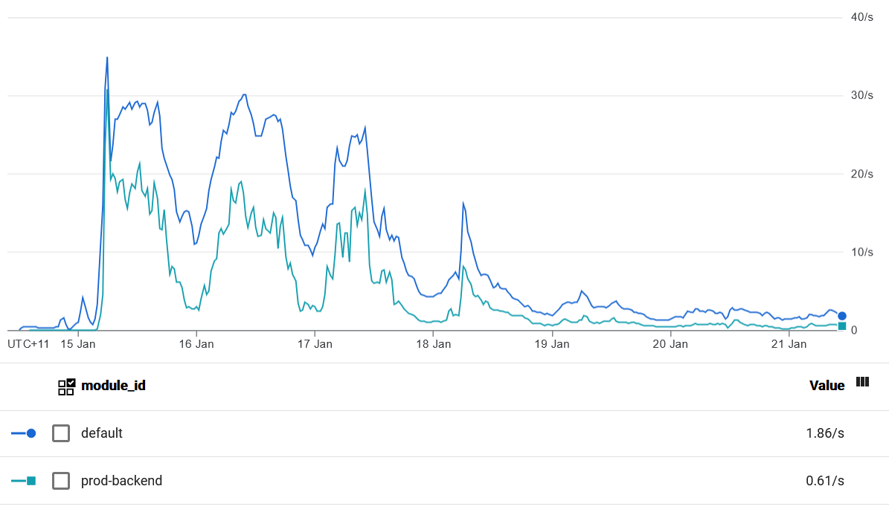

# Tech stack
In preparing for the 2022 hunt, our team spent several weeks researching, configuring and iterating on infrastructure. This document is a tour of our setup, and a guide to hopefully make it much faster if you're running a hunt similar to ours.

## Environments
We chose to have a separate `prod` and `staging` environment. Each developer could also have their own `dev` environment. Configs for all of these were checked in, and CI/CD pipelines were set up to make deployment standardised and simple.

See [deploy.md](deploy.md#environments) for some more info on how we configured the environments.

## Hosting
We hosted on a combination of Heroku and Google Cloud, depending on the environment and phase of hunt. Other hosting solutions such as a VPS should be entirely fine too!


### Heroku
For staging and posthunt, we chose Heroku as our host.

Advantages:
 - It has a generous free tier, so we could run it without worrying unduly about budget. For our staging environment, we were entirely in the free tier. For our posthunt production environment, we're paying about $15/month as detailed below.
 - It's easy to set up (as detailed in our [deployment guide](deploy.md)) so we could kickstart our staging server quickly.
 - It deploys relatively quickly.
 - Heroku dynos support WebSockets so the infrastructure was easier to set up.

Issues:
 - It became annoying as our codebase grew, because we kept running into slug size issues. At several points, this broke our deployment and development and so became a critical issue.
 - The free tier only allows one deployment at a time. We handled this by cancelling the earlier deployment, which meant in the pre-release crunch, it could take a few deploys before changes made it to staging.
 - When deploying to Heroku, you need to [check out all commits](https://mikecoutermarsh.com/github-actions-deploy-to-heroku/) which made it more expensive in Github Actions.
 - Heroku uses a special method (ALIAS or ANAME records) for authenticating domains that doesn't work for root domains with many domain registrars. They [list officially supported registrars](https://devcenter.heroku.com/articles/custom-domains#add-a-custom-root-domain). We used [Google Domains](#google-domains) which required some [special workarounds](https://nikodunk.com/heroku-ssl-google-domains-2019/) to avoid SSL-certificate issues.
 - Heroku has limited observability tools, and (by default) no log retention, so debugging issues can be challenging.

Our configuration:
 - App: `palindrome-hunt-prod`
    - Dyno: 1x hobby dyno ($7/mo)
       - Why: needed for SSL certificates. As a benefit, the larger memory lets us cache every page comfortably.
    - Database: 1x hobby basic PG instance ($9/mo)
       - Why: needed for non-trivial row limits and connection limits.
       - Usage: about 60k rows, 63 MB size after 1 month running as the posthunt instance. So a lower tier may be okay.
    - Config vars
       - `DATABASE_URL`: auto-generated to match the database instance above
       - `DJANGO_ENV`: `prod_heroku`
       - `HEROKU_BUILDPACK_GIT_LFS_REPO`: `https://<PERSONAL ACCESS TOKEN>@github.com/Palindrome-Puzzles/2022-hunt`
       - `MAILGUN_API_KEY`: `<MAILGUN API KEY>`
       - `ON_HEROKU`: `1`
       - `SECRET_KEY`: `<DJANGO SECRET KEY>`
          - Note: this matches the secret key used in our Google App Engine production environment, so that they can use the same URL schemes for CDN assets.
    - Buildpacks
       - `heroku/nodejs`
       - `heroku/python`
       - `https://github.com/raxod502/heroku-buildpack-git-lfs`
    - SSL Certificates: automatically managed using ACM
    - Domains: `www.bookspace.world`, `www.starrats.org`, and `www.mitmh2022.com` with the `CNAME` DNS targets set up
 - App: `palindrome-hunt-staging`
    - Dyno: free dyno
    - Database: free (hobby dev) PG instance
       - Usage: about 6k rows, 17 MB size after 6 months running as the staging instance.
    - Config vars: same as above except
       - `DJANGO_ENV`: `staging_heroku`
    - Buildpacks: same as above
    - No SSL Certificates or custom domains

This was all attached to a specific shared Heroku account, and the billing details were associated with the shared Heroku account. We added the personal Heroku accounts of our tech team as collaborators on each project.

[.slugignore](/.slugignore) controls files that are skipped being deployed to Heroku. Note: this process is inefficient as first it deploys them and then deletes them...

[`/Procfile`](/Procfile) defines how to start up the Heroku instance, and declares a post-release script.

### Google Cloud
For the prod environment, we used Google Cloud with Google App Engine (GAE) as the hosting platform. We also temporarily ran a staging version of the Google Cloud environment, to test out configurations.

Google Cloud has $300 tier of free credit for new accounts. It's easy to underestimate spend, and unfortunately, our temporary staging version of our Google Cloud environment blew through most of that. As a lesson, be diligent checking billing when you make changes, and verify the spend matches your expectations. (In their Billing platform, uncheck "discounts" in the bottom right to get a non-misleading picture of your spending.)

We used it in production because:
 - It's been tested before including in the 2021 hunt.
 - It has excellent monitoring and logging tools.
 - Our team was more familiar scaling Gogole Cloud services than with Heroku services.

We made a choice to host both our staging and prod services under the same Google Cloud project. This made management easier and let us share resources like the Redis server, although it did expose us to slightly more risk of a misconfiguration in our staging environment making our prod environment vulnerable.

#### App Engine
We used App Engine's Standard environment for the hunt website including HQ, registration, and the solver-visible experience. This was relatively cheap and easy to scale. At one point, we consider splitting the website into multiple microservices like [the 2021 hunt](https://github.com/YewLabs/silenda/blob/master/dispatch.yaml). However, this increased costs significantly as the baseline of having 3 always-available services was much more expensive than having just 1. (In fact, this is what ate through a lot of our $300 credit.)

We used App Engine's Flexible environment for handling websocket connections. This is because the Standard environment doesn't support websockets. We used much fewer instances of this.

App Engine is largely configured declaratively. You can see our website configs at [`/app-prod-site.yaml`](/app-prod-site.yaml) (and [`/app-staging-site.yaml`](/app-staging-site.yaml)). Notice that it starts the WSGI version of our Django app.
 - The prod config normally ran with `automatic_scaling` and an instance class of `F4_1G` during the hunt. We changed it to `basic_scaling` so that we could stop it completely.
 - During the hunt, prod was set to `max_instances: 50` and `min_instances: 1`.
 - The `warmup` service is defined in [`/hunt/deploy/urls/common.py`](/hunt/deploy/urls/common.py) and is a health check built into GAE.
 - The [VPC connector](#vpc-connector) is required to talk to Redis from an GAE standard instance.
 - [.gcloudignore](/.gcloudignore) controls files that are skipped from being deployed.

Our backend (WebSocket) config is at [`/app-prod-backend.yaml`](/app-prod-backend.yaml) (and [`/app-staging-backend.yaml`](/app-staging-backend.yaml)). It uses a custom Docker image (configured in [`/Dockerfile`](/Dockerfile)), uses the GAE-specific `requirements.txt` file, and starts the ASGI version of our Django app.
 - It enables `session_affinity` so WebSockets work.
 - It uses the default Python docker image, which at the time of writing was Python 3.7. This means some code that used Python 3.9 features broke with a slow feedback loop. We needed to use workarounds like conditionally using `importlib_resources` in [`/hunt/data_loader/`](/hunt/data_loader/).

We added custom domains for our app as documented by [GAE](https://cloud.google.com/appengine/docs/standard/python3/mapping-custom-domains) and [Google Domains](https://support.google.com/domains/answer/6009957?hl=en).

The routing between services by domain and path is set up in [`dispatch.yaml`](dispatch.yaml).

Issues:
 - App Engine doesn't delete old versions by default. This can cause sudden breakages in our deployment process. For the Standard environment, we added a step to prune old versions. For the Flexible environment, we couldn't work out how to prune automatically, and so need to periodically clear out old versions.
 - App Engine can be surprisingly expensive. For example, using F4_1G instances is 6x more expensive than F1 instances, and so suddenly, the 28 free daily hours doesn't go very far. App Engine frontend hours was by far the most expensive infrastructure item.

In total, we spent about $1k on App Engine.


*Our GAE traffic during and after hunt - frontend and backend were both serving a peak around 30qps*

#### Cloud SQL
We used Cloud SQL as our Postgres database. I think we used PG v14.
 - Setting up and granting users access was a bit of a pain. I kept running into internal tables that were created by the default `postgres` and so couldn't be accessed by our `hunt` user, or vice-versa. It was also a little tricky getting `psql` working when we wanted to make changes.
 - `pgadmin` is also an annoyingly unintuitive and slow tool, but not much we can do about that.
 - Create the instance small by default, and temporarily increase it's scale a few days before the hunt. For example, we started single zone and a lightweight machine. Just before hunt, we turned on high availability and increased the machine size. This required a few minutes of downtime to restart.
 - It does not need to be large amount of storage, and the storage cannot be decreased later (without a migration). 5 GB would have been plenty for us, althought we were paying for about 40 GB.
 - Disable maintenance around the time of the hunt.

This was a non-trivial expense in the order of $4/day, so be prepared to (backup and then) delete the database shortly after hunt is over. This was one of the forcing functions to migrate our posthunt website to Heroku.

In total, we spent about $300 on Cloud SQL.

#### Cloud Storage
We used Google Cloud Storage as our CDN. We created a separate bucket from the free bucket as we wanted control over the name (the free bucket was called `mitmh-2022.appspot.com` and this would be part of the asset URLs). We also had a separate bucket between staging and prod for isolation of environments - this was needed because each environment had separate Django secret keys, and so the hashed puzzle file names were different.

Important ACLs:
 - `allUsers` should be a `Storage Legacy Object Reader`. This lets files be public without letting the public browse all files. Initially, we used `Storage Object Viewer` and nearly leaked a lot of puzzle content.
 - Our Github actions service account was a `Storage Object Admin`

We developed a process for deploying files to Google Cloud Storage. These commands are documented in [.github/workflows/deploy-puzzle-files.yml](/.github/workflows/deploy-puzzle-files.yml) and use the `gsutil` command. It has separate `copy` and `rsync` commands with subtle distinctions about how they handle recursive directories, so this combination of flags worked well. (Note: the comment about not using the `-d` flag to `rsync` during the hunt, to prevent breaking a puzzle during a deploy.)

> **Note**: We wrote the `collectpuzzlefiles` Django command, and adapted our `gsutil` commands to serve files as gzipped files. This does not come for free with Cloud Storage, and is an essential part of a CDN, so we recommend taking a look at how our scripts work.

> **Note**: We needed to set up [CORS for our Google Cloud buckets](https://cloud.google.com/storage/docs/configuring-cors). The configurations used live at [`/hunt/deploy/gcloud_cors/`](/hunt/deploy/gcloud_cors/).

Issues:
 - A strategy for cache-busting is critical. Files can be cached indefinitely after you deploy them to Cloud Storage, and we definitely observed >30 min delays before a change would propagate.
 - Our deployment to Cloud Storage was independent of our deployment to the hunt website. We ignored this issue, but it can lead to temporary breakages of puzzles if you deploy a change that affects both the hunt website and the assets themselves.
 - There is an auto-generated `us.artifacts...` bucket that ballooned in size leading to and during hunt. I think this contains build artifacts from either App Engine standard or flexible deployment. This was much larger than the total storage of all other puzzle assets, and so the storage costs of this bucket became non-trivial. It took some digging to track down the cause -- it may be worth keeping an eye on it.

In total, we spent about $200 on Cloud Storage. Almost all of this was bandwidth costs for the >1.2 TB of data we served during and after hunt weekend.

#### Redis
We used Redis (part of Memorystore) to communicate between processes (for WebSockets) and for caching. Our configuration was:
 - 1 GB capacity
 - Basic tier
 - `us-central1-f` zone
 - Price: about $35/mo

Our total spend was about $60.

#### VPC Connector
We needed a VPC connector so GAE Standard could talk to Redis. For this, we used serverless VPC access.

We noted the Redis IP so that we could get a [VPC connector](#vpc-connector) in the same network. For example, our redis IP was `10.24.56.xyz:6379`, so we got a VPC connector in `10.24.56.0/28`.

Our configuration was:
 - name: `redis-vpc-connector`
 - zone: `us-central1`
 - size: `e2-micro`
 - instances: `2-5`

Our total spend was about $10.

#### Secret Manager
We stored some secrets in Secret Manager so they could be accessed by Github Actions, or by code at startup. We stored the following secrets.
 - `hunt-database-url-prod`: The 12-factor database URL to access the production PG database.
 - `hunt-database-url-staging`: The 12-factor database URL to access the staging PG database.
 - `hunt-secret-key-prod`: The Django secret key for production.
    - Note: this matches the secret key for our Heroku production environment, so we can use the same CDN assets.
 - `hunt-secret-key-staging`: The Django secret key for staging.
 - `mailgun-api-key`: The mailgun API key.
 - `redis-host`: The IP of our Redis host `10.24.56.xyz`

#### Cloud Functions
We used a cloud function to handle clearing our Redis cache as part of our release process. This was needed because otherwise, we can't access the Google internal network.

`nuke_cache` cloud function:
 - trigger: HTTP
 - memory: 256 MB

It used Google's internal authentication. You can see the function at [`/cloud_functions/nuke_cache/`](/cloud_functions/nuke_cache/) and the deployment process in [the relevant Github workflow](/.github/workflows/deploy-nuke-cache-cloud-function.yml).

#### Observability
Early on, it's worth enabling whatever observability tools you can. We turned on at least 90 days of logs retention, query instrumentation in Cloud SQL, and regularly checked the Error Reporting dashboard.

#### IAM
We ended up with the following permissions.
 - For members of the tech team, `Editor` or `Owner` as appropriate.
 - For our Github Actions service account `     github-actions@mitmh-2022.iam.gserviceaccount.com`:
    - App Engine Deployer
    - App Engine Service Admin
    - Cloud Build Editor
    - Cloud Functions Developer
    - Cloud SQL Client
    - Cloud SQL Instance User
    - Compute Viewer
    - Secret Manager Secret Accessor
    - Serverless VPC Access User
    - Service Account Token Creator
    - Service Account User
    - Storage Object Admin

## Incoming emails
This was tricky as we had several conflicting requirements.
 - Before hunt, we wanted access to a few people in an easy-to-use interface.
 - During hunt, we wanted many people to be able to reply, with tools for indicating who was currently replying.
 - We wanted programmatic access to emails, so we could identify self-help or book report submissions.
 - We wanted a reliable archive of emails, even if we moved hosts (and databases).
 - Should be low-cost.

In the end, we did the following.
 - Make a shared email account for the 2022 hunt. (We actually made separate ones for staging and prod.)
 - Use Gmail's account delegation to share access to several team members before the hunt. It was especially important for the swag team to have access, as that required a lot of coordination.
 - Use [SendGrid's free email parsing service](https://sendgrid.com/blog/how-to-receive-emails-with-the-flask-framework-for-python/) to receive emails and forward them to a webhook running on our production server.
 - In the [webhook](/spoilr/email/views/incoming_views.py), perform the following:
    - Save the email to the database.
    - Raise an event that an email was received. This let us do further processing if necessary like [recognising self-help submissions](/hunt/app/core/interactions.py).
    - Relay the email to our shared inbox using Mailgun.

Almost of all these goals had issues that affected real solvers trying to contact us. So definitely learn from the issues we ran into!
 - If the webhook raises an error, SendGrid will call it again later (amazing!), which can lead to duplicate emails in the database.
 - If we change hosts/databases, emails are lost from the database. This was expected, but an extra source of work.
 - Emails were real data we received before the hunt started. That meant if we had database migrations, we needed to handle it properly, instead of our common strategy of wipe the table and move it. This added work for our team.
 - Emails come in many shapes. We had plenty of errors due to assumptions about fields, that caused delays in email relaying. Examples include: the `to` field can contain a name and email `ABC <abc@mitmh2022.com>`, the `to` field can contain multiple emails `abc@mitmh2022.com,my-group@googlegroups.com`, attachments can be missing names/mime types, both the plain and html bodies could be empty, and more.
 - Mailgun's API was strict and sometimes the emails we received could not be relayed because of these limitations. For example, the body might be too large, or mailgun requires some content in the plain or html body.
 - DMARC: we chose to relay emails but keep the "from" address unchanged. This made it easy to scan our shared email inbox. However, for many domains, this can't work because the domains have DMARC verification turned on. We played whack-a-mole where we checked Mailgun errors regularly, found domains with DMARC errors that were not being delivered, and added a workaround in [`/hunt/deploy/settings/_base.py`](/hunt/deploy/settings/_base.py) in `SPOILR_RELAY_IMPERSONATE_BLACKLIST`.
 - The SendGrid docs weren't great and had typos that meant implementation took time.

This system mostly worked, but if done again, we'd change the relay to change the "from" address (and keep the "reply-to" unchanged), and train our team to understand why it got changed. We may also look into other systems where we wouldn't be responsible for relaying emails ourselves.

For staging, we already had a CNAME for `staging.`, so we couldn't set up an MX for `staging.`. As a result, our incoming email was the awkward `...@staging-mail.mitmh2022.com`.

After the hunt, we plan to change to Google Domains' [free email forwarding](https://support.google.com/domains/answer/3251241?hl=en), as we no longer need programmatic access.

Other things to consider:
 - [Mailgun](https://documentation.mailgun.com/en/latest/quickstart-receiving.html#how-to-start-receiving-inbound-email) would have probably been a better choice. I can't remember why I didn't choose them, but it may have been pricing, or a very short time to make a decision.

## Outgoing emails
We used mailgun. They have a generous free tier of 5k emails per month for 3 months, which was enough for our pre-hunt needs. During hunt, we moved to their Foundation plan for $35 for the SLA boost.

We used `mg.mitmh2022.com` as the prod sending domain.

Issues:
 - 5 day log retention. Instead, I used a script in `bin/mailgun-log-downloader.py` to regularly download logs.

In total, we spent $35.

## Domains
We used Google Domains as our domain host. This was mostly fine, with some complications when moving our hosting to Heroku with SSL certificates as [noted above](#heroku).

For all 3 domains (using mitmh2022.com as an example):
 - Domain forwarding of mitmh2022.com to https://www.mitmh2022.com (301, forward path, SSL on) to address Heroku issue
 - Earlier, `www.mitmh2022.com` `CNAME` was `ghs.googlehosted.com.`

Our DNS records were as follows.

**www.mitmh2022.com**
```
mitmh2022.com    MX    mx.sendgrid.net.
[...].mitmh2022.com    CNAME   [...].sendgrid.net.
mailo._domainkey.mg.mitmh2022.com   TXT    [...]
mg.mitmh2022.com    MX    10 mxa.mailgun.org.
mg.mitmh2022.com    MX    10 mxb.mailgun.org.
mg.mitmh2022.com    TXT     "v=spf1 include:mailgun.org ~all"
s1._domainkey.mitmh2022.com    CNAME    s1.domainkey.[...].sendgrid.net.
s2._domainkey.mitmh2022.com    CNAME    s2.domainkey.[...].sendgrid.net.
staging.mitmh2022.com    CNAME    ghs.googlehosted.com.
staging-mail.mitmh2022.com    MX    10 mx.sendgrid.net.
www.mitmh2022.com    CNAME    [...].herokudns.com.
```
 - Soon, remove the `MX` record for `mitmh2022.com`, and use Google Domain's free email forwarding.

**www.bookspace.world**
```
staging.bookspace.world    CNAME    ghs.googlehosted.com.
www.bookspace.world    CNAME    [...].herokudns.com.
```

**www.starrats.org**
```
staging.starrats.org    CNAME    ghs.googlehosted.com.
www.starrats.org    CNAME    [...].herokudns.com.
```

## Website access token
Our staging environments were publicly accessible on the web. To avoid accidentally releasing our puzzles early, we used a combination of a "website access token" and secure user accounts.

The website access token was controlled by the `HUNT_WEBSITE_ACCESS_TOKEN` Django setting. If present, and say `HUNT_WEBSITE_ACCESS_TOKEN = abc123`, then to access the staging website, you first needed to visit `https://staging.mitmh2022.com/abc123`.

## Github Actions
To set up Github Actions, we created a [service account](https://cloud.google.com/docs/authentication/getting-started) in the Cloud Console. It was `github-actions@` and had roles as [described above](#iam). We created a JSON service key and downloaded it. (This auth method has now been deprecated btw.)

We declared the following secrets in Github for the repo.
 - `GCLOUD_PROJECT_ID` - the project name in Google Cloud, `mitmh-2022`
 - `GOOGLE_APPLICATIONS_CREDENTIAL` - the content of the JSON service key above
 - `HEROKU_API_KEY_PROD` - the API key from Heroku for the prod app
 - `HEROKU_API_KEY_STAGING` - the API key from Heroku for the staging app
 - `HEROKU_APP_NAME_PROD` - the app name for the prod app `palindrome-hunt-prod`
 - `HEROKU_APP_NAME_STAGING` - the app name for the prod app `palindrome-hunt-prod`
 - ~~`REPO_RW_TOKEN` - a Personal Access Token for access to our repos.~~ No longer used, but was initially used when we used Git submodules to split up our repository.

We all up spent about $250 on Github. This was split between Github Actions minutes, and LFS data packs as each deployment required re-fetching the repository.

Depending on the phase of the project, we turned on or off automatic deployments. For example, we automatically deployed to staging in the lead up to hunt.
